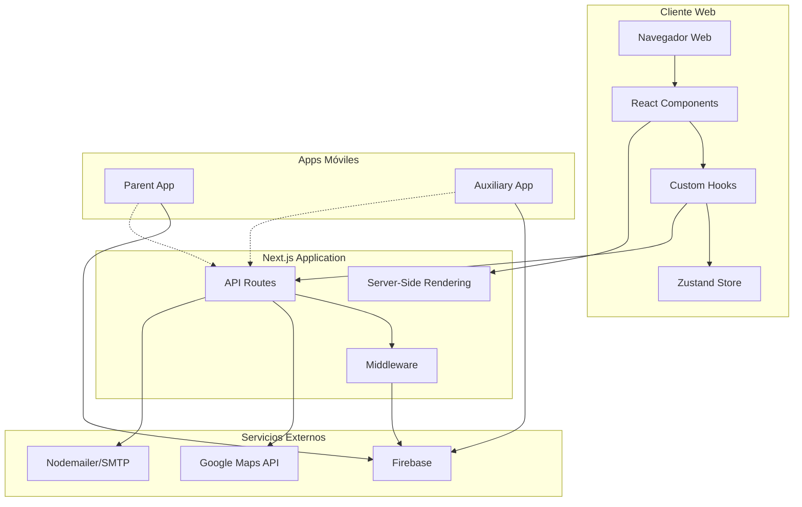
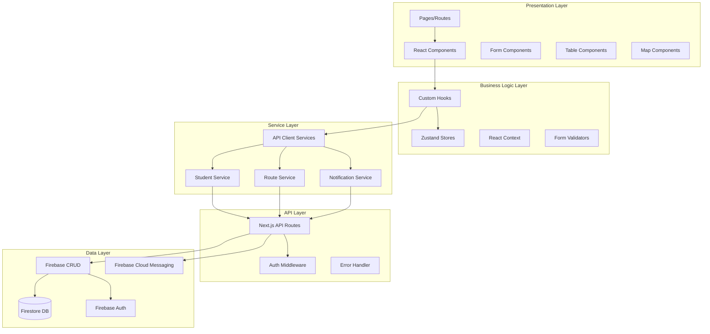
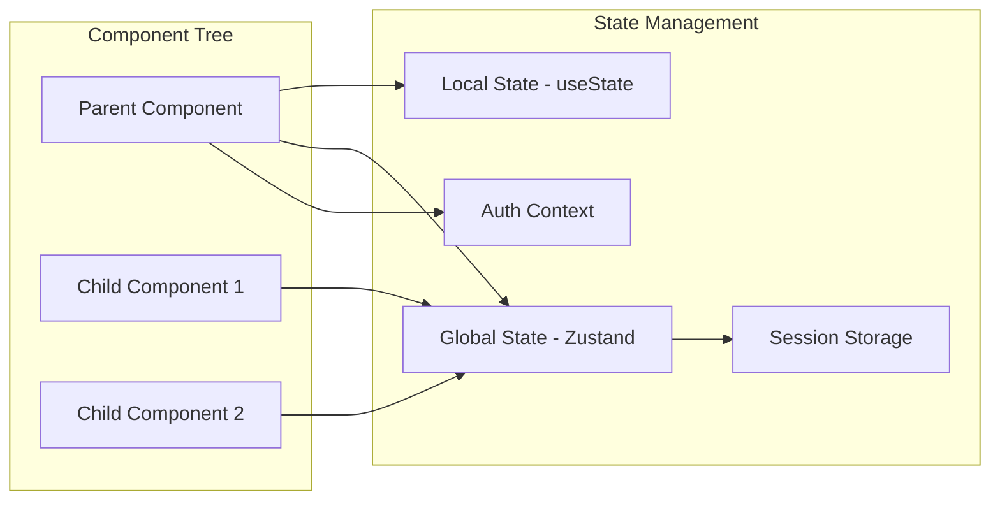
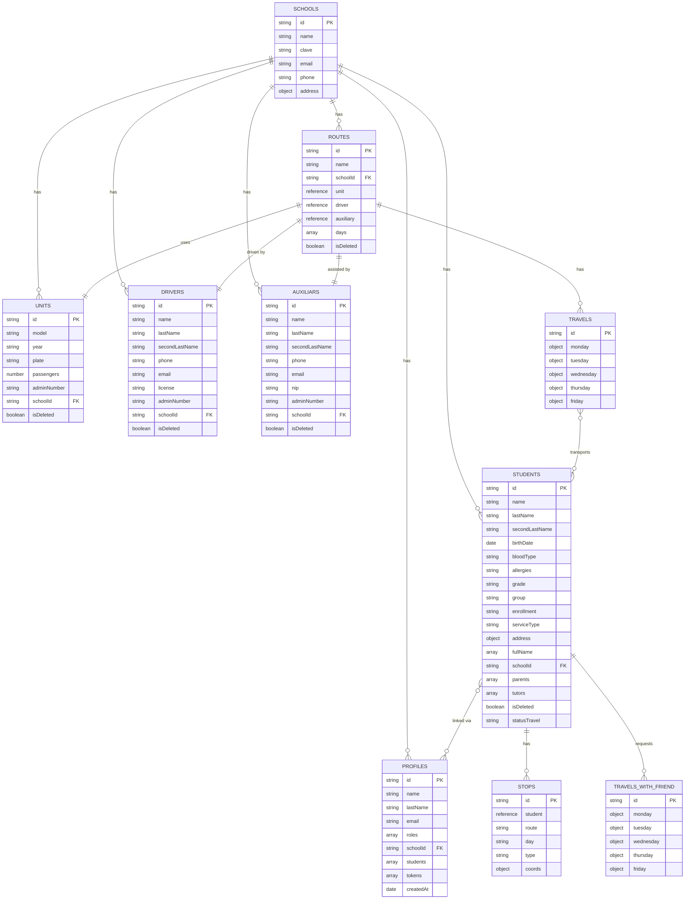
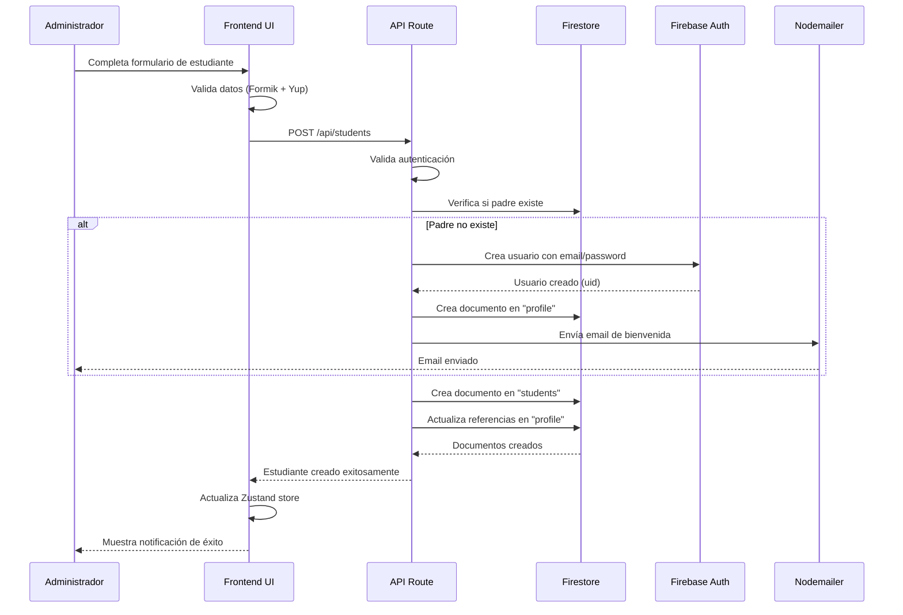
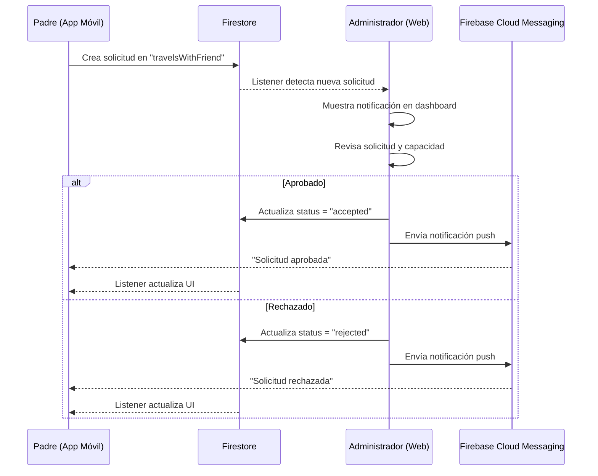
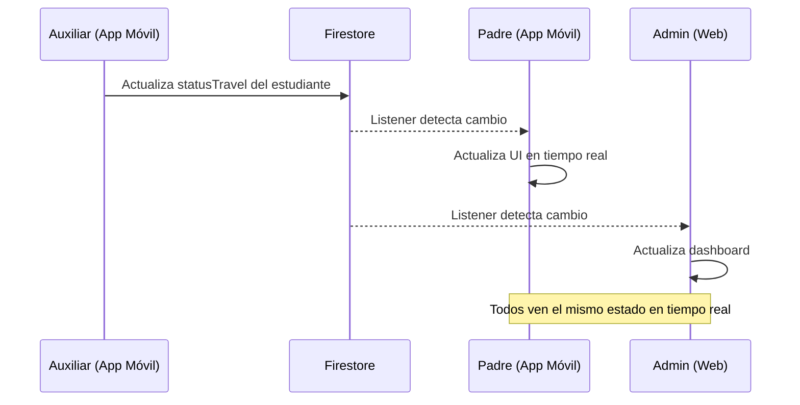

# Arquitectura del Sistema RutEs-Admin

## Índice

1. [Visión General](#visión-general)
2. [Arquitectura de Alto Nivel](#arquitectura-de-alto-nivel)
3. [Arquitectura Frontend](#arquitectura-frontend)
4. [Arquitectura Backend](#arquitectura-backend)
5. [Capa de Datos](#capa-de-datos)
6. [Flujos de Datos Principales](#flujos-de-datos-principales)
7. [Decisiones Arquitectónicas](#decisiones-arquitectónicas)

## Visión General

RutEs-Admin implementa una arquitectura **Full-Stack Serverless** utilizando Next.js 14 con el paradigma de **App Router**, aprovechando las capacidades de renderizado del servidor (SSR) y componentes de servidor (Server Components) para optimizar el rendimiento y SEO.

### Características Arquitectónicas Clave

- **Monolito Modular**: Una aplicación que contiene frontend y backend en el mismo repositorio
- **Serverless**: Sin servidores que gestionar, funciones bajo demanda
- **Real-time Database**: Base de datos con capacidades de sincronización en tiempo real
- **API-first**: APIs RESTful bien definidas para integración con apps móviles
- **Component-driven**: UI construida con componentes reutilizables

## Arquitectura de Alto Nivel

### Diagrama de Arquitectura General



### Diagrama de Capas



## Arquitectura Frontend

### Estructura de Componentes

```
┌─────────────────────────────────────────────┐
│           App Router Layout                 │
│  ┌───────────────────────────────────────┐  │
│  │     Authentication Provider           │  │
│  │  ┌─────────────────────────────────┐  │  │
│  │  │      Dashboard Layout           │  │  │
│  │  │  ┌───────────┬──────────────┐   │  │  │
│  │  │  │  Sidebar  │  Main Area   │   │  │  │
│  │  │  │           │  ┌────────┐  │   │  │  │
│  │  │  │  - Nav    │  │ Page   │  │   │  │  │
│  │  │  │  - Menu   │  │Content │  │   │  │  │
│  │  │  │           │  └────────┘  │   │  │  │
│  │  │  └───────────┴──────────────┘   │  │  │
│  │  └─────────────────────────────────┘  │  │
│  └───────────────────────────────────────┘  │
└─────────────────────────────────────────────┘
```

### Flujo de Estado



### Patrones de Componentes

#### 1. Componentes de Presentación (Presentational)

Componentes puros que solo reciben props y renderizan UI:

```jsx
// components/ui/Button.jsx
export function Button({ children, variant, onClick, disabled }) {
  return (
    <button
      className={cn(buttonVariants({ variant }))}
      onClick={onClick}
      disabled={disabled}
    >
      {children}
    </button>
  );
}
```

#### 2. Componentes Contenedores (Container)

Componentes que manejan lógica y estado:

```jsx
// components/StudentList.jsx
'use client'

export function StudentList() {
  const { students, loading } = useStudentStore();
  const { loadStudents } = useStudentManager();

  useEffect(() => {
    loadStudents();
  }, []);

  if (loading) return <Spinner />;

  return (
    <div>
      {students.map(student => (
        <StudentCard key={student.id} student={student} />
      ))}
    </div>
  );
}
```

#### 3. Componentes de Servidor (Server Components)

Componentes que se renderizan en el servidor:

```jsx
// app/dashboard/students/page.jsx
import { getStudents } from '@/services/students';

export default async function StudentsPage() {
  const students = await getStudents();

  return (
    <div>
      <h1>Estudiantes</h1>
      <StudentTable students={students} />
    </div>
  );
}
```

### Gestión de Estado

#### Zustand Stores

```javascript
// store/useStudentStore.js
import { create } from 'zustand';
import { persist } from 'zustand/middleware';

export const useStudentStore = create(
  persist(
    (set, get) => ({
      students: [],
      selectedStudent: null,

      setStudents: (students) => set({ students }),

      addStudent: (student) =>
        set((state) => ({
          students: [...state.students, student]
        })),

      updateStudent: (id, updates) =>
        set((state) => ({
          students: state.students.map(s =>
            s.id === id ? { ...s, ...updates } : s
          )
        })),

      deleteStudent: (id) =>
        set((state) => ({
          students: state.students.filter(s => s.id !== id)
        }))
    }),
    {
      name: 'student-storage',
      storage: createJSONStorage(() => sessionStorage)
    }
  )
);
```

#### Context API para Autenticación

```javascript
// context/AuthContext.jsx
'use client'

const AuthContext = createContext({});

export function AuthProvider({ children }) {
  const [user, setUser] = useState(null);
  const [loading, setLoading] = useState(true);

  useEffect(() => {
    const unsubscribe = onAuthStateChanged(auth, async (firebaseUser) => {
      if (firebaseUser) {
        // Obtener datos adicionales del usuario
        const userData = await getUserData(firebaseUser.uid);
        setUser({ ...firebaseUser, ...userData });
      } else {
        setUser(null);
      }
      setLoading(false);
    });

    return unsubscribe;
  }, []);

  return (
    <AuthContext.Provider value={{ user, loading }}>
      {children}
    </AuthContext.Provider>
  );
}
```

### Custom Hooks

```javascript
// hooks/useStudentManager.js
export function useStudentManager() {
  const { setStudents, addStudent } = useStudentStore();
  const [loading, setLoading] = useState(false);

  const loadStudents = async () => {
    setLoading(true);
    try {
      const data = await getStudents();
      setStudents(data);
    } catch (error) {
      toast.error('Error al cargar estudiantes');
    } finally {
      setLoading(false);
    }
  };

  const createStudent = async (studentData) => {
    try {
      const newStudent = await createStudentAPI(studentData);
      addStudent(newStudent);
      toast.success('Estudiante creado exitosamente');
      return newStudent;
    } catch (error) {
      toast.error('Error al crear estudiante');
      throw error;
    }
  };

  return {
    loading,
    loadStudents,
    createStudent
  };
}
```

## Arquitectura Backend

### API Routes Estructura

```
/api
├── auth/
│   └── profile/
│       └── route.js          # GET, PATCH (perfil de usuario)
├── students/
│   ├── route.js              # GET, POST, DELETE
│   ├── bulk-upload/
│   │   └── route.js          # POST (carga masiva)
│   └── search/
│       └── route.js          # GET (búsqueda)
├── parents/
│   └── route.js              # GET, POST, PATCH, DELETE
├── drivers/
│   └── route.js              # GET, POST, PATCH, DELETE
├── auxiliars/
│   └── route.js              # GET, POST, PATCH, DELETE
├── units/
│   └── route.js              # GET, POST, PATCH, DELETE
├── routes/
│   └── [id]/
│       └── route.js          # GET (ruta con estudiantes)
├── travel/
│   └── route.js              # GET, POST, PATCH
├── travel-with-friend/
│   └── route.js              # GET, POST, PATCH
├── notifications/
│   └── route.js              # GET, POST
├── schools/
│   └── route.js              # GET, POST, PATCH
└── mail/
    └── route.js              # POST (envío de emails)
```

### Patrón de API Route

```javascript
// app/api/students/route.js
import { NextResponse } from 'next/server';
import { getUser } from '@/firebase/validateToken';
import { collection, query, where, getDocs } from 'firebase/firestore';
import { db } from '@/firebase/config';

// GET - Listar estudiantes
export async function GET(request) {
  try {
    // 1. Autenticación
    const user = await getUser(request);
    if (!user) {
      return NextResponse.json(
        { error: 'No autorizado' },
        { status: 401 }
      );
    }

    // 2. Obtener schoolId del usuario
    const { schoolId } = user;

    // 3. Query a Firestore
    const q = query(
      collection(db, 'students'),
      where('schoolId', '==', schoolId),
      where('isDeleted', '==', false)
    );

    const querySnapshot = await getDocs(q);

    // 4. Mapear documentos
    const students = querySnapshot.docs.map(doc => ({
      id: doc.id,
      ...doc.data()
    }));

    // 5. Respuesta
    return NextResponse.json(students);

  } catch (error) {
    console.error('Error:', error);
    return NextResponse.json(
      { error: 'Error interno del servidor' },
      { status: 500 }
    );
  }
}

// POST - Crear estudiante
export async function POST(request) {
  try {
    const user = await getUser(request);
    if (!user) {
      return NextResponse.json(
        { error: 'No autorizado' },
        { status: 401 }
      );
    }

    // Validar rol
    if (!user.roles.includes('admin')) {
      return NextResponse.json(
        { error: 'Permiso denegado' },
        { status: 403 }
      );
    }

    const body = await request.json();

    // Validación de datos
    if (!body.name || !body.lastName) {
      return NextResponse.json(
        { error: 'Datos incompletos' },
        { status: 400 }
      );
    }

    // Crear documento
    const studentData = {
      ...body,
      schoolId: user.schoolId,
      createdAt: new Date(),
      isDeleted: false
    };

    const docRef = await addDoc(
      collection(db, 'students'),
      studentData
    );

    return NextResponse.json({
      id: docRef.id,
      ...studentData
    }, { status: 201 });

  } catch (error) {
    console.error('Error:', error);
    return NextResponse.json(
      { error: 'Error al crear estudiante' },
      { status: 500 }
    );
  }
}
```

### Middleware de Autenticación

```javascript
// firebase/validateToken.js
import { auth as adminAuth } from './admin';
import { cookies } from 'next/headers';

export async function getUser(request) {
  try {
    // Obtener token de cookies
    const cookieStore = cookies();
    const token = cookieStore.get('session')?.value;

    if (!token) {
      return null;
    }

    // Verificar token con Firebase Admin
    const decodedToken = await adminAuth.verifyIdToken(token);

    // Obtener datos adicionales del usuario
    const userDoc = await getDoc(
      doc(db, 'profile', decodedToken.uid)
    );

    if (!userDoc.exists()) {
      return null;
    }

    return {
      uid: decodedToken.uid,
      email: decodedToken.email,
      ...userDoc.data()
    };

  } catch (error) {
    console.error('Error validating token:', error);
    return null;
  }
}
```

### Servicio de Notificaciones

```javascript
// app/api/notifications/route.js
import { messaging } from '@/firebase/admin';

export async function POST(request) {
  try {
    const user = await getUser(request);
    if (!user) {
      return NextResponse.json({ error: 'Unauthorized' }, { status: 401 });
    }

    const { title, body, category, userIds } = await request.json();

    // Obtener tokens FCM de los usuarios
    const usersSnapshot = await getDocs(
      query(
        collection(db, 'profile'),
        where('__name__', 'in', userIds)
      )
    );

    const tokens = [];
    usersSnapshot.forEach(doc => {
      const userData = doc.data();
      if (userData.tokens && userData.tokens.length > 0) {
        tokens.push(...userData.tokens);
      }
    });

    // Enviar notificación multicast
    if (tokens.length > 0) {
      const message = {
        notification: {
          title,
          body
        },
        data: {
          category,
          timestamp: new Date().toISOString()
        },
        tokens
      };

      const response = await messaging.sendMulticast(message);

      console.log(`${response.successCount} notificaciones enviadas`);
    }

    // Guardar notificación en Firestore
    await addDoc(
      collection(db, `notificationsSchool/${user.schoolId}/notifications`),
      {
        title,
        body,
        category,
        createdAt: new Date(),
        readByUser: false,
        readByAux: false,
        readByTutor: false,
        readBySchool: false
      }
    );

    return NextResponse.json({
      success: true,
      sent: tokens.length
    });

  } catch (error) {
    console.error('Error sending notification:', error);
    return NextResponse.json(
      { error: 'Error al enviar notificación' },
      { status: 500 }
    );
  }
}
```

## Capa de Datos

### Esquema de Firebase Firestore



### Colección de Profiles

```javascript
profile/{userId} = {
  name: "Juan Pérez",
  lastName: "García",
  email: "juan@example.com",
  roles: ["user"], // admin-rutes, admin, user-school, user, tutor, auxiliary
  schoolId: "school_abc123",
  students: [
    { reference to student_1 },
    { reference to student_2 }
  ],
  tokens: [
    "fcm_token_android_123",
    "fcm_token_ios_456"
  ],
  createdAt: Timestamp,
  password: "hashedPassword" // Solo para auxiliares (NIP)
}
```

### Colección de Students

```javascript
students/{studentId} = {
  name: "María",
  lastName: "González",
  secondLastName: "López",
  birthDate: Timestamp,
  bloodType: "O+",
  allergies: "Ninguna",
  grade: "3",
  group: "A",
  enrollment: "2023001",
  serviceType: "complete", // complete, morning, afternoon
  address: {
    street: "Av. Principal 123",
    neighborhood: "Centro",
    city: "CDMX",
    state: "Ciudad de México",
    zipCode: "06000",
    coords: {
      lat: 19.4326,
      lng: -99.1332
    }
  },
  fullName: ["maria", "gonzalez", "lopez"], // Para búsqueda
  schoolId: "school_abc123",
  parents: [
    { reference to profile_parent1 },
    { reference to profile_parent2 }
  ],
  tutors: [
    { reference to profile_tutor1 }
  ],
  isDeleted: false,
  statusTravel: "waiting" // waiting, in-transit, delivered
}
```

### Colección de Routes

```javascript
routes/{routeId} = {
  name: "Ruta Norte",
  schoolId: "school_abc123",
  unit: { reference to unit_xyz },
  driver: { reference to driver_abc },
  auxiliary: { reference to auxiliary_def },
  days: ["monday", "tuesday", "wednesday", "thursday", "friday"],
  isDeleted: false,
  createdAt: Timestamp
}
```

### Colección de Travels

```javascript
travels/{routeId} = {
  monday: {
    toSchool: {
      stops: [
        {
          coords: { lat: 19.4326, lng: -99.1332 },
          students: [
            { reference to student_1 },
            { reference to student_2 }
          ]
        },
        {
          coords: { lat: 19.4350, lng: -99.1350 },
          students: [
            { reference to student_3 }
          ]
        }
      ]
    },
    toHome: {
      stops: [...]
    },
    workshop: {
      stops: [...]
    }
  },
  tuesday: {...},
  wednesday: {...},
  thursday: {...},
  friday: {...}
}
```

### Colección de TravelsWithFriend

```javascript
travelsWithFriend/{studentId} = {
  monday: {
    route: { reference to route_xyz },
    student: { reference to student_123 },
    status: "pending", // pending, accepted, rejected
    date: Timestamp,
    approvedBy: "admin_user_id"
  },
  tuesday: null,
  wednesday: {...},
  thursday: null,
  friday: null
}
```

## Flujos de Datos Principales

### Flujo 1: Creación de Estudiante con Padre



### Flujo 2: Solicitud de Viaje con Amigo



### Flujo 3: Seguimiento de Ruta en Tiempo Real



## Decisiones Arquitectónicas

### 1. ¿Por qué Next.js?

**Decisión**: Utilizar Next.js 14 como framework principal

**Razones**:
- SSR y SSG para mejor SEO y rendimiento inicial
- API Routes integradas evitan necesidad de servidor separado
- App Router permite arquitectura moderna con Server Components
- Optimización automática de imágenes y code splitting
- Despliegue sencillo en Vercel
- Gran ecosistema y comunidad

**Trade-offs**:
- Curva de aprendizaje del App Router
- Vendor lock-in parcial con Vercel (aunque es portable)

### 2. ¿Por qué Firebase?

**Decisión**: Utilizar Firebase como backend (Firestore, Auth, FCM)

**Razones**:
- Real-time database nativa para sincronización
- Autenticación robusta out-of-the-box
- Push notifications integradas (FCM)
- Escala automática sin configuración
- SDK compartido entre web y móvil
- Sin gestión de infraestructura

**Trade-offs**:
- Vendor lock-in con Google
- Costos pueden crecer con escala
- Queries limitadas comparado con SQL
- Requiere modelado cuidadoso de datos

### 3. ¿Por qué Zustand sobre Redux?

**Decisión**: Utilizar Zustand para gestión de estado global

**Razones**:
- API más simple y menos boilerplate
- Mejor performance (sin re-renders innecesarios)
- TypeScript-first
- Hooks nativos
- Persistencia sencilla con middleware

**Trade-offs**:
- Menos herramientas de debugging que Redux DevTools
- Comunidad más pequeña

### 4. ¿Por qué Monolito sobre Microservicios?

**Decisión**: Aplicación monolítica modular

**Razones**:
- Menor complejidad operacional
- Despliegue más sencillo
- Ideal para el tamaño actual del proyecto
- Costos reducidos
- Desarrollo más rápido

**Trade-offs**:
- Menos escalabilidad horizontal
- Acoplamiento entre módulos
- Despliegues all-or-nothing

### 5. ¿Por qué Serverless?

**Decisión**: Arquitectura serverless con Vercel Functions

**Razones**:
- Sin gestión de servidores
- Escalado automático
- Pago por uso
- Despliegues atómicos
- Rollbacks instantáneos

**Trade-offs**:
- Cold starts ocasionales
- Límites de tiempo de ejecución (10s en Vercel)
- Difícil testear localmente entorno idéntico

---

**Documento de Arquitectura**
Última actualización: Noviembre 2025
Versión del Sistema: 0.1.0
