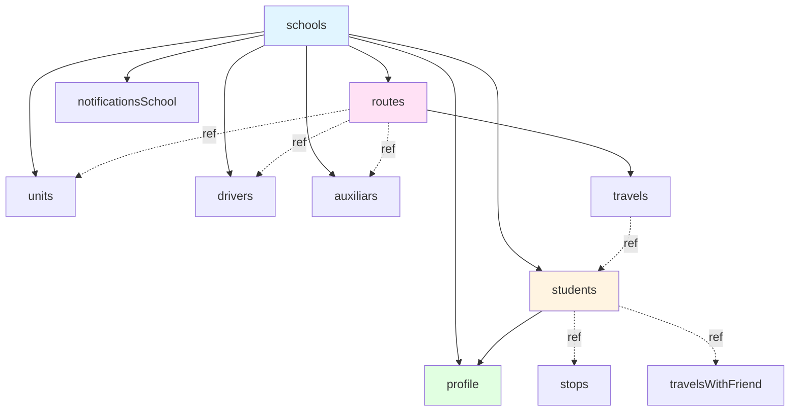

# Base de Datos - RutEs-Admin

## Índice

1. [Introducción](#introducción)
2. [Esquema General](#esquema-general)
3. [Colecciones Detalladas](#colecciones-detalladas)
4. [Relaciones entre Colecciones](#relaciones-entre-colecciones)
5. [Índices y Optimización](#índices-y-optimización)
6. [Reglas de Seguridad](#reglas-de-seguridad)
7. [Queries Comunes](#queries-comunes)
8. [Mejores Prácticas](#mejores-prácticas)

## Introducción

RutEs-Admin utiliza **Firebase Firestore** como base de datos NoSQL. Firestore es una base de datos de documentos que almacena datos en colecciones de documentos, donde cada documento es un conjunto de pares clave-valor.

### Características de Firestore

- **NoSQL Orientado a Documentos**: Almacena datos en formato JSON
- **Real-time**: Sincronización en tiempo real mediante listeners
- **Escalabilidad**: Escala automáticamente según demanda
- **Offline**: Capacidades offline-first en apps móviles
- **Transacciones**: Soporte ACID para operaciones críticas
- **Seguridad**: Reglas de seguridad granulares

### Convenciones de Nomenclatura

- Colecciones: `camelCase` (ej: `students`, `travelsWithFriend`)
- Campos: `camelCase` (ej: `firstName`, `createdAt`)
- Referencias: Tipo `DocumentReference` de Firestore
- Timestamps: Tipo `Timestamp` de Firestore
- Booleanos: Prefijo `is` (ej: `isDeleted`, `isActive`)

## Esquema General

### Diagrama de Relaciones



### Lista de Colecciones

| Colección | Tipo | Descripción |
|-----------|------|-------------|
| `schools` | Raíz | Escuelas registradas en la plataforma |
| `students` | Raíz | Estudiantes de todas las escuelas |
| `routes` | Raíz | Rutas de transporte |
| `travels` | Raíz | Configuración diaria de rutas con paradas |
| `stops` | Raíz | Asignación individual de estudiantes a paradas |
| `units` | Raíz | Vehículos/autobuses |
| `drivers` | Raíz | Conductores |
| `auxiliars` | Raíz | Auxiliares/nanas |
| `profile` | Raíz | Perfiles de usuarios (padres, tutores, admins) |
| `travelsWithFriend` | Raíz | Solicitudes de viaje con amigo |
| `notificationsSchool` | Raíz | Notificaciones por escuela |
| `notificationsSchool/{schoolId}/notifications` | Subcolección | Notificaciones individuales |

## Colecciones Detalladas

### 1. Collection: `schools`

Información de las escuelas registradas en la plataforma.

```typescript
schools/{schoolId} = {
  // Identificación
  name: string,                    // "Colegio Benito Juárez"
  clave: string,                   // Clave de identificación oficial

  // Contacto
  email: string,                   // "contacto@colegio.edu.mx"
  phone: string,                   // "+52 55 1234 5678"

  // Ubicación
  address: {
    street: string,                // "Av. Reforma 123"
    neighborhood: string,          // "Centro"
    city: string,                  // "Ciudad de México"
    state: string,                 // "CDMX"
    zipCode: string,              // "06000"
    coords: {
      lat: number,                 // 19.4326
      lng: number                  // -99.1332
    }
  },

  // Metadata
  createdAt: Timestamp,
  updatedAt: Timestamp,
  isActive: boolean                // true
}
```

**Índices Recomendados**:
- `clave` (Ascendente)
- `isActive` (Ascendente)

---

### 2. Collection: `students`

Registro completo de estudiantes.

```typescript
students/{studentId} = {
  // Información Personal
  name: string,                    // "María"
  lastName: string,                // "González"
  secondLastName: string,          // "López"
  birthDate: Timestamp,            // Fecha de nacimiento
  bloodType: string,               // "O+", "A-", "B+", etc.
  allergies: string,               // "Ninguna" o descripción

  // Información Académica
  grade: string,                   // "1", "2", "3", etc.
  group: string,                   // "A", "B", "C"
  enrollment: string,              // "2023001"
  serviceType: string,             // "complete" | "morning" | "afternoon"

  // Dirección
  address: {
    street: string,
    neighborhood: string,
    city: string,
    state: string,
    zipCode: string,
    reference: string,             // Opcional
    coords: {
      lat: number,
      lng: number
    }
  },

  // Referencias
  schoolId: string,                // ID de la escuela
  parents: DocumentReference[],    // Array de refs a profile
  tutors: DocumentReference[],     // Array de refs a profile

  // Estado de Viaje
  statusTravel: string,            // "waiting" | "in-transit" | "delivered"

  // Búsqueda
  fullName: string[],              // ["maria", "gonzalez", "lopez"]

  // Metadata
  createdAt: Timestamp,
  updatedAt: Timestamp,
  isDeleted: boolean               // Soft delete
}
```

**Índices Compuestos Requeridos**:
- `schoolId` (Asc) + `isDeleted` (Asc)
- `schoolId` (Asc) + `grade` (Asc) + `group` (Asc)
- `fullName` (Array)

**Campos para Búsqueda**:
El campo `fullName` se usa para búsquedas de texto:
```javascript
fullName: [
  "maria",
  "gonzalez",
  "lopez",
  "maria gonzalez",
  "maria gonzalez lopez"
]
```

---

### 3. Collection: `routes`

Definición de rutas de transporte.

```typescript
routes/{routeId} = {
  // Identificación
  name: string,                    // "Ruta Norte"
  schoolId: string,                // Referencia a escuela

  // Asignaciones (Referencias a documentos)
  unit: DocumentReference,         // Referencia a units/{unitId}
  driver: DocumentReference,       // Referencia a drivers/{driverId}
  auxiliary: DocumentReference,    // Referencia a auxiliars/{auxiliarId}

  // Configuración
  days: string[],                  // ["monday", "tuesday", "wednesday", "thursday", "friday"]

  // Metadata
  createdAt: Timestamp,
  updatedAt: Timestamp,
  isDeleted: boolean
}
```

**Índices Requeridos**:
- `schoolId` (Asc) + `isDeleted` (Asc)

---

### 4. Collection: `travels`

Configuración diaria de viajes con paradas y estudiantes. Un documento por ruta.

```typescript
travels/{routeId} = {
  monday: {
    toSchool: {
      stops: [
        {
          coords: {
            lat: number,           // 19.4326
            lng: number            // -99.1332
          },
          students: DocumentReference[]  // [ref(student1), ref(student2)]
        }
      ]
    },
    toHome: {
      stops: [...]
    },
    workshop: {
      stops: [...]
    }
  },
  tuesday: { ... },
  wednesday: { ... },
  thursday: { ... },
  friday: { ... }
}
```

**Estructura de Días**:
- Cada día tiene 3 momentos: `toSchool`, `toHome`, `workshop`
- Cada momento tiene array de `stops`
- Cada stop tiene `coords` y array de `students` (referencias)

**Ejemplo Real**:
```javascript
{
  monday: {
    toSchool: {
      stops: [
        {
          coords: { lat: 19.4326, lng: -99.1332 },
          students: [
            firestore.doc('students/student_123'),
            firestore.doc('students/student_456')
          ]
        },
        {
          coords: { lat: 19.4350, lng: -99.1350 },
          students: [
            firestore.doc('students/student_789')
          ]
        }
      ]
    },
    toHome: {
      stops: [
        {
          coords: { lat: 19.4350, lng: -99.1350 },
          students: [firestore.doc('students/student_789')]
        },
        {
          coords: { lat: 19.4326, lng: -99.1332 },
          students: [
            firestore.doc('students/student_123'),
            firestore.doc('students/student_456')
          ]
        }
      ]
    },
    workshop: null
  }
}
```

---

### 5. Collection: `stops`

Registro individual de asignación de estudiantes a paradas. Alternativa/complemento a `travels`.

```typescript
stops/{stopId} = {
  student: DocumentReference,      // Referencia a students/{studentId}
  route: string,                   // ID de la ruta
  day: string,                     // "monday", "tuesday", etc.
  type: string,                    // "toSchool" | "toHome" | "workshop"
  coords: {
    lat: number,
    lng: number
  },
  createdAt: Timestamp
}
```

**Índices Compuestos**:
- `route` (Asc) + `day` (Asc) + `type` (Asc)
- `student` (Asc)

---

### 6. Collection: `units`

Vehículos/autobuses del transporte escolar.

```typescript
units/{unitId} = {
  // Identificación
  model: string,                   // "Mercedes Benz Sprinter"
  year: string,                    // "2022"
  plate: string,                   // "ABC-123-XYZ"

  // Capacidad
  passengers: number,              // 25

  // Referencia
  schoolId: string,
  adminNumber: string,             // Número administrativo interno

  // Metadata
  createdAt: Timestamp,
  updatedAt: Timestamp,
  isDeleted: boolean
}
```

**Índices Requeridos**:
- `schoolId` (Asc) + `isDeleted` (Asc)
- `plate` (Asc) - Único

---

### 7. Collection: `drivers`

Conductores del transporte escolar.

```typescript
drivers/{driverId} = {
  // Información Personal
  name: string,                    // "Juan"
  lastName: string,                // "Pérez"
  secondLastName: string,          // "García"

  // Contacto
  phone: string,                   // "+52 55 1234 5678"
  email: string,                   // "juan.perez@example.com"

  // Licencia
  license: string,                 // "A1234567"
  licenseExpiry: Timestamp,        // Opcional

  // Referencia
  schoolId: string,
  adminNumber: string,             // Número de nómina/admin

  // Metadata
  createdAt: Timestamp,
  updatedAt: Timestamp,
  isDeleted: boolean
}
```

**Índices Requeridos**:
- `schoolId` (Asc) + `isDeleted` (Asc)

---

### 8. Collection: `auxiliars`

Auxiliares/nanas del transporte escolar.

```typescript
auxiliars/{auxiliarId} = {
  // Información Personal
  name: string,                    // "Ana"
  lastName: string,                // "Martínez"
  secondLastName: string,          // "Rodríguez"

  // Contacto
  phone: string,                   // "+52 55 1234 5678"
  email: string,                   // "ana.martinez@example.com"

  // Acceso
  nip: string,                     // "1234" - PIN para app móvil

  // Referencia
  schoolId: string,
  adminNumber: string,             // Número de nómina/admin

  // Metadata
  createdAt: Timestamp,
  updatedAt: Timestamp,
  isDeleted: boolean
}
```

**Índices Requeridos**:
- `schoolId` (Asc) + `isDeleted` (Asc)
- `email` (Asc)

---

### 9. Collection: `profile`

Perfiles de usuarios del sistema (padres, tutores, administradores).

```typescript
profile/{userId} = {
  // Información Personal
  name: string,                    // "Laura"
  lastName: string,                // "Sánchez"
  secondLastName: string,          // Opcional
  email: string,                   // "laura@example.com"
  phone: string,                   // "+52 55 1234 5678"

  // Roles y Permisos
  roles: string[],                 // ["user"] | ["admin"] | ["tutor"] | ["auxiliary"]
                                   // Posibles: "admin-rutes", "admin", "user-school", "user", "tutor", "auxiliary"

  // Referencias
  schoolId: string,                // ID de la escuela
  students: DocumentReference[],   // Array de refs a students

  // Notificaciones Push
  tokens: string[],                // FCM tokens ["token1", "token2"]

  // Autenticación (solo para auxiliares)
  password: string,                // Hash del NIP (solo auxiliares)

  // Metadata
  createdAt: Timestamp,
  updatedAt: Timestamp,
  lastLogin: Timestamp
}
```

**Índices Requeridos**:
- `email` (Asc) - Único
- `schoolId` (Asc) + `roles` (Array)

**Roles Explicados**:
- `admin-rutes`: Super admin de la plataforma (acceso a todas las escuelas)
- `admin`: Administrador escolar (acceso completo a su escuela)
- `user-school`: Usuario secundario (solo ve tracking, sin datos personales)
- `user`: Padre de familia (acceso desde app móvil)
- `tutor`: Tutor legal (acceso desde app móvil)
- `auxiliary`: Auxiliar (acceso desde app móvil con NIP)

---

### 10. Collection: `travelsWithFriend`

Solicitudes de cambio temporal de ruta (viaje con amigo).

```typescript
travelsWithFriend/{studentId} = {
  monday: {
    route: DocumentReference,      // Ruta a la que quiere ir
    student: DocumentReference,    // Estudiante solicitante
    status: string,                // "pending" | "accepted" | "rejected"
    date: Timestamp,               // Fecha de solicitud
    approvedBy: string,            // userId del admin que aprobó
    approvedAt: Timestamp          // Fecha de aprobación
  },
  tuesday: null,
  wednesday: {
    route: DocumentReference,
    student: DocumentReference,
    status: "pending",
    date: Timestamp
  },
  thursday: null,
  friday: null
}
```

**Notas**:
- El ID del documento es el `studentId`
- Cada día puede tener una solicitud o ser `null`
- Estados: `pending` (esperando), `accepted` (aprobado), `rejected` (rechazado)

---

### 11. Collection: `notificationsSchool`

Notificaciones organizadas por escuela.

```typescript
notificationsSchool/{schoolId} = {
  name: string,                    // Nombre de la escuela (denormalizado)
  createdAt: Timestamp
}

// Subcolección
notificationsSchool/{schoolId}/notifications/{notificationId} = {
  // Contenido
  title: string,                   // "Retraso en Ruta Norte"
  body: string,                    // "El autobús tendrá 15 min de retraso"
  category: string,                // "emergency" | "travel" | "status" | "travelWithFriend" | "general"

  // Destinatarios
  sentTo: string[],                // Array de userIds

  // Estado de Lectura
  readByUser: boolean,             // Leído por padres/tutores
  readByAux: boolean,              // Leído por auxiliares
  readByTutor: boolean,            // Leído por tutores
  readBySchool: boolean,           // Leído por admin escuela

  // Metadata
  createdAt: Timestamp,
  createdBy: string                // userId del creador
}
```

**Categorías de Notificaciones**:
- `emergency`: Emergencias críticas
- `travel`: Actualizaciones de viajes
- `status`: Cambios de estado
- `travelWithFriend`: Respuestas a solicitudes de viaje con amigo
- `general`: Comunicados generales

**Índices en Subcolección**:
- `category` (Asc) + `createdAt` (Desc)
- `createdAt` (Desc)

## Relaciones entre Colecciones

### Tipo de Relaciones

Firestore no tiene JOINs como SQL. Las relaciones se manejan mediante:

1. **Referencias de Documento** (`DocumentReference`)
2. **Denormalización** (duplicar datos)
3. **Subcolecciones**

### Mapa de Relaciones

```
schools (1) ──────────────── (*) students
schools (1) ──────────────── (*) routes
schools (1) ──────────────── (*) units
schools (1) ──────────────── (*) drivers
schools (1) ──────────────── (*) auxiliars
schools (1) ──────────────── (*) profile

students (*) ──────────────── (*) profile (many-to-many via arrays)
students (1) ──────────────── (*) stops
students (1) ──────────────── (1) travelsWithFriend

routes (1) ──────────────────  (1) travels
routes (*) ──────────────────  (1) units
routes (*) ──────────────────  (1) drivers
routes (*) ──────────────────  (1) auxiliars

travels (*) ──────────────────  (*) students (via references)
```

### Ejemplo de Query con Referencias

```javascript
// Obtener estudiantes de una ruta en un día específico
const routeId = "route_123";
const travelDoc = await getDoc(doc(db, "travels", routeId));
const travelData = travelDoc.data();

// Acceder a estudiantes de la primera parada del lunes (toSchool)
const studentRefs = travelData.monday.toSchool.stops[0].students;

// Obtener datos de cada estudiante
const studentsData = await Promise.all(
  studentRefs.map(ref => getDoc(ref))
);

const students = studentsData.map(doc => ({
  id: doc.id,
  ...doc.data()
}));
```

## Índices y Optimización

### Índices Compuestos Requeridos

Firebase Firestore requiere índices compuestos para queries con múltiples filtros u ordenamiento.

```javascript
// Índice requerido para:
// students WHERE schoolId == "abc" AND isDeleted == false ORDER BY lastName
{
  collection: "students",
  fields: [
    { field: "schoolId", mode: "ASCENDING" },
    { field: "isDeleted", mode: "ASCENDING" },
    { field: "lastName", mode: "ASCENDING" }
  ]
}

// Índice para búsqueda de estudiantes por grado y grupo
{
  collection: "students",
  fields: [
    { field: "schoolId", mode: "ASCENDING" },
    { field: "grade", mode: "ASCENDING" },
    { field: "group", mode: "ASCENDING" }
  ]
}

// Índice para notificaciones por categoría y fecha
{
  collection: "notificationsSchool/{schoolId}/notifications",
  fields: [
    { field: "category", mode: "ASCENDING" },
    { field: "createdAt", mode: "DESCENDING" }
  ]
}
```

### Estrategias de Optimización

1. **Limitar Queries**: Usar `.limit()` para grandes conjuntos
2. **Paginación**: Implementar cursor-based pagination
3. **Denormalización Estratégica**: Duplicar datos frecuentemente accedidos
4. **Batch Operations**: Agrupar escrituras relacionadas
5. **Caché Local**: Usar persistencia local de Firestore

```javascript
// Ejemplo de paginación
const pageSize = 20;
const firstPage = query(
  collection(db, "students"),
  where("schoolId", "==", schoolId),
  orderBy("lastName"),
  limit(pageSize)
);

// Siguiente página
const lastVisible = querySnapshot.docs[querySnapshot.docs.length - 1];
const nextPage = query(
  collection(db, "students"),
  where("schoolId", "==", schoolId),
  orderBy("lastName"),
  startAfter(lastVisible),
  limit(pageSize)
);
```

## Reglas de Seguridad

### Firestore Security Rules

```javascript
rules_version = '2';
service cloud.firestore {
  match /databases/{database}/documents {

    // Helper functions
    function isSignedIn() {
      return request.auth != null;
    }

    function isAdmin() {
      return isSignedIn() &&
             get(/databases/$(database)/documents/profile/$(request.auth.uid)).data.roles.hasAny(['admin', 'admin-rutes']);
    }

    function belongsToSchool(schoolId) {
      return isSignedIn() &&
             get(/databases/$(database)/documents/profile/$(request.auth.uid)).data.schoolId == schoolId;
    }

    // Students
    match /students/{studentId} {
      allow read: if isSignedIn() && belongsToSchool(resource.data.schoolId);
      allow create: if isAdmin();
      allow update, delete: if isAdmin() && belongsToSchool(resource.data.schoolId);
    }

    // Routes
    match /routes/{routeId} {
      allow read: if isSignedIn() && belongsToSchool(resource.data.schoolId);
      allow write: if isAdmin() && belongsToSchool(resource.data.schoolId);
    }

    // Profile
    match /profile/{userId} {
      allow read: if isSignedIn() && request.auth.uid == userId;
      allow update: if isSignedIn() && request.auth.uid == userId;
      allow create, delete: if isAdmin();
    }

    // Schools (solo admin-rutes)
    match /schools/{schoolId} {
      allow read: if isSignedIn();
      allow write: if isAdmin();
    }
  }
}
```

## Queries Comunes

### 1. Obtener todos los estudiantes de una escuela

```javascript
import { collection, query, where, getDocs } from 'firebase/firestore';

const getStudentsBySchool = async (schoolId) => {
  const q = query(
    collection(db, 'students'),
    where('schoolId', '==', schoolId),
    where('isDeleted', '==', false)
  );

  const querySnapshot = await getDocs(q);
  return querySnapshot.docs.map(doc => ({
    id: doc.id,
    ...doc.data()
  }));
};
```

### 2. Buscar estudiantes por nombre

```javascript
const searchStudentsByName = async (schoolId, searchTerm) => {
  const q = query(
    collection(db, 'students'),
    where('schoolId', '==', schoolId),
    where('fullName', 'array-contains', searchTerm.toLowerCase()),
    where('isDeleted', '==', false)
  );

  const querySnapshot = await getDocs(q);
  return querySnapshot.docs.map(doc => ({
    id: doc.id,
    ...doc.data()
  }));
};
```

### 3. Obtener ruta con estudiantes

```javascript
const getRouteWithStudents = async (routeId) => {
  // Obtener datos de la ruta
  const routeDoc = await getDoc(doc(db, 'routes', routeId));
  const routeData = routeDoc.data();

  // Obtener configuración de viajes
  const travelDoc = await getDoc(doc(db, 'travels', routeId));
  const travelData = travelDoc.data();

  // Resolver referencias de estudiantes
  const resolveStudents = async (stops) => {
    if (!stops) return [];

    return Promise.all(
      stops.map(async stop => {
        const students = await Promise.all(
          stop.students.map(ref => getDoc(ref))
        );

        return {
          coords: stop.coords,
          students: students.map(doc => ({
            id: doc.id,
            ...doc.data()
          }))
        };
      })
    );
  };

  // Procesar todos los días
  const days = ['monday', 'tuesday', 'wednesday', 'thursday', 'friday'];
  const travelsWithStudents = {};

  for (const day of days) {
    if (travelData[day]) {
      travelsWithStudents[day] = {
        toSchool: await resolveStudents(travelData[day].toSchool?.stops),
        toHome: await resolveStudents(travelData[day].toHome?.stops),
        workshop: await resolveStudents(travelData[day].workshop?.stops)
      };
    }
  }

  return {
    id: routeDoc.id,
    ...routeData,
    travels: travelsWithStudents
  };
};
```

### 4. Obtener solicitudes pendientes de viaje con amigo

```javascript
const getPendingTravelRequests = async () => {
  const snapshot = await getDocs(collection(db, 'travelsWithFriend'));

  const pending = [];

  snapshot.forEach(doc => {
    const data = doc.data();
    const days = ['monday', 'tuesday', 'wednesday', 'thursday', 'friday'];

    days.forEach(day => {
      if (data[day] && data[day].status === 'pending') {
        pending.push({
          studentId: doc.id,
          day,
          ...data[day]
        });
      }
    });
  });

  return pending;
};
```

### 5. Listener en tiempo real para notificaciones

```javascript
import { onSnapshot } from 'firebase/firestore';

const listenToNotifications = (schoolId, callback) => {
  const q = query(
    collection(db, `notificationsSchool/${schoolId}/notifications`),
    orderBy('createdAt', 'desc'),
    limit(50)
  );

  const unsubscribe = onSnapshot(q, (snapshot) => {
    const notifications = snapshot.docs.map(doc => ({
      id: doc.id,
      ...doc.data()
    }));

    callback(notifications);
  });

  return unsubscribe; // Llamar para detener el listener
};

// Uso
const unsubscribe = listenToNotifications('school_123', (notifications) => {
  console.log('Nuevas notificaciones:', notifications);
});

// Cleanup
// unsubscribe();
```

## Mejores Prácticas

### 1. Soft Deletes

Siempre usar `isDeleted: true` en lugar de eliminar documentos:

```javascript
// ❌ Mal
await deleteDoc(doc(db, 'students', studentId));

// ✅ Bien
await updateDoc(doc(db, 'students', studentId), {
  isDeleted: true,
  deletedAt: Timestamp.now()
});
```

### 2. Batch Writes para Operaciones Múltiples

```javascript
import { writeBatch } from 'firebase/firestore';

const batchUpdateStudents = async (updates) => {
  const batch = writeBatch(db);

  updates.forEach(({ id, data }) => {
    const ref = doc(db, 'students', id);
    batch.update(ref, data);
  });

  await batch.commit();
};
```

### 3. Transacciones para Operaciones Críticas

```javascript
import { runTransaction } from 'firebase/firestore';

const approveTravelWithFriend = async (studentId, day, routeId) => {
  await runTransaction(db, async (transaction) => {
    // 1. Leer ruta destino para verificar capacidad
    const routeRef = doc(db, 'routes', routeId);
    const routeDoc = await transaction.get(routeRef);

    // 2. Leer travel config
    const travelRef = doc(db, 'travels', routeId);
    const travelDoc = await transaction.get(travelRef);

    // Validar capacidad...

    // 3. Actualizar solicitud
    const requestRef = doc(db, 'travelsWithFriend', studentId);
    transaction.update(requestRef, {
      [`${day}.status`]: 'accepted',
      [`${day}.approvedAt`]: Timestamp.now()
    });
  });
};
```

### 4. Denormalización Estratégica

Duplicar datos frecuentemente accedidos para reducir reads:

```javascript
// En lugar de hacer 2 reads:
const student = await getDoc(doc(db, 'students', studentId));
const school = await getDoc(doc(db, 'schools', student.data().schoolId));

// Denormalizar nombre de escuela en estudiante:
students/{studentId} = {
  ...,
  schoolId: "school_123",
  schoolName: "Colegio Benito Juárez"  // Denormalizado
}
```

### 5. Usar Timestamps del Servidor

```javascript
import { serverTimestamp } from 'firebase/firestore';

// ✅ Usar timestamp del servidor
await addDoc(collection(db, 'students'), {
  name: "María",
  createdAt: serverTimestamp()  // Se genera en el servidor
});

// ❌ No usar timestamp del cliente
await addDoc(collection(db, 'students'), {
  name: "María",
  createdAt: new Date()  // Puede variar según zona horaria
});
```

---

**Documento de Base de Datos**
Última actualización: Noviembre 2025
Versión: 1.0
Sistema: RutEs-Admin con Firebase Firestore
