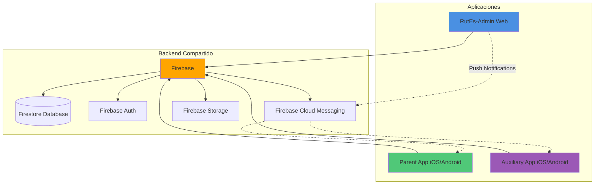
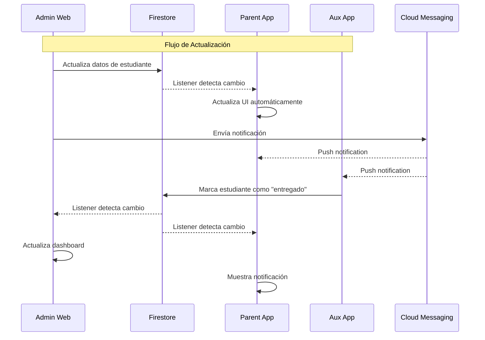
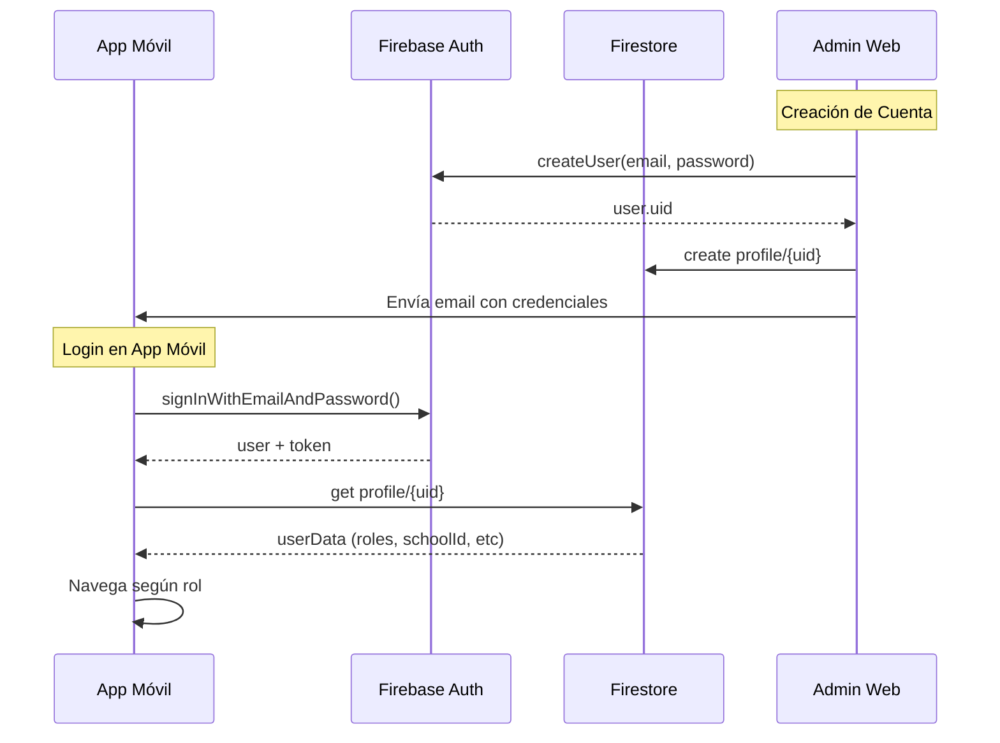
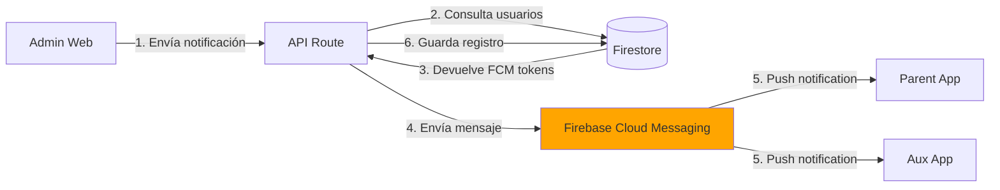
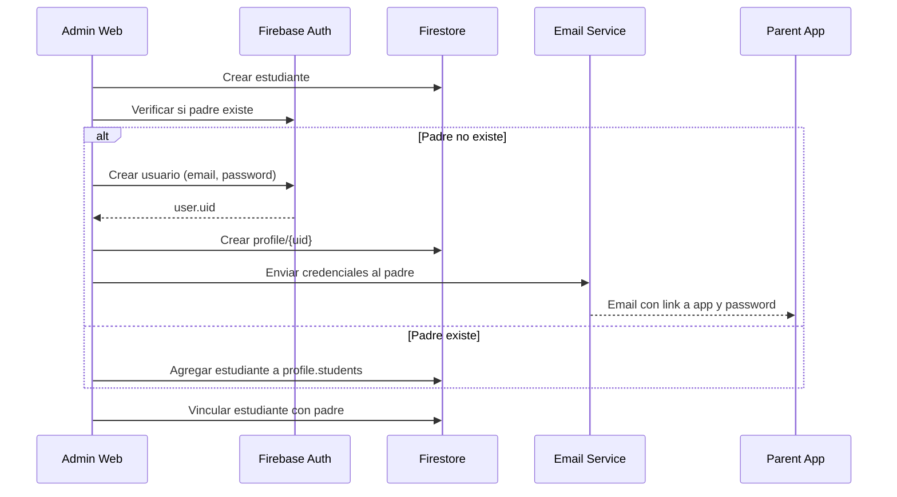
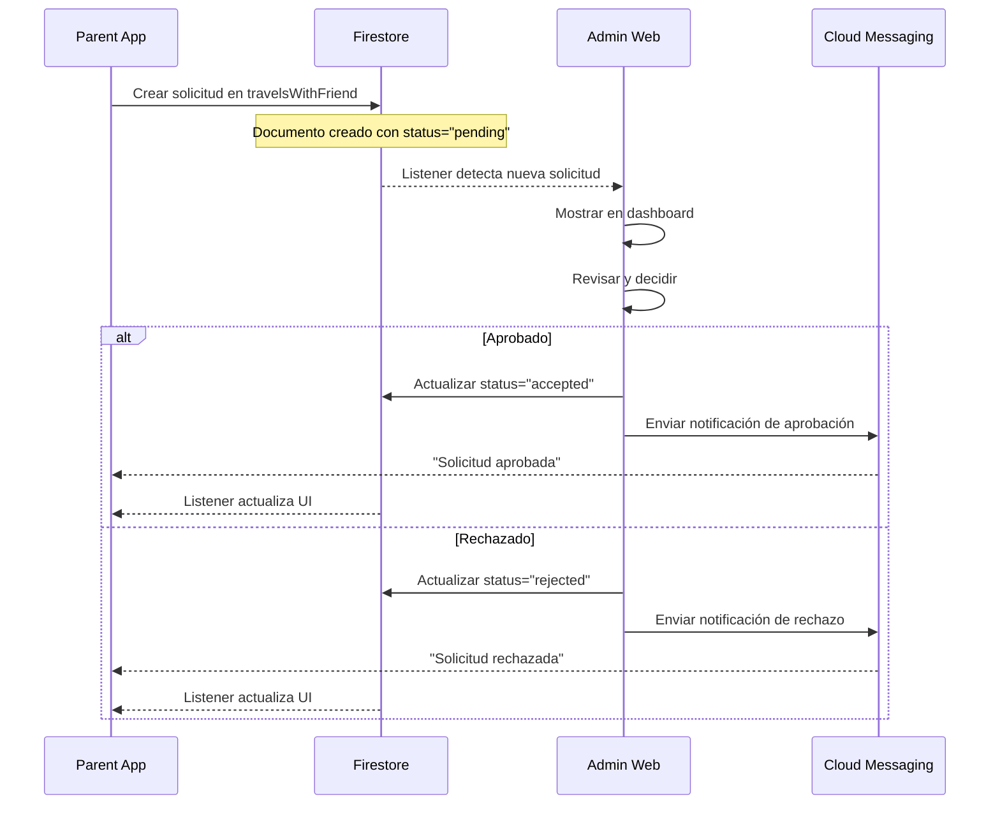
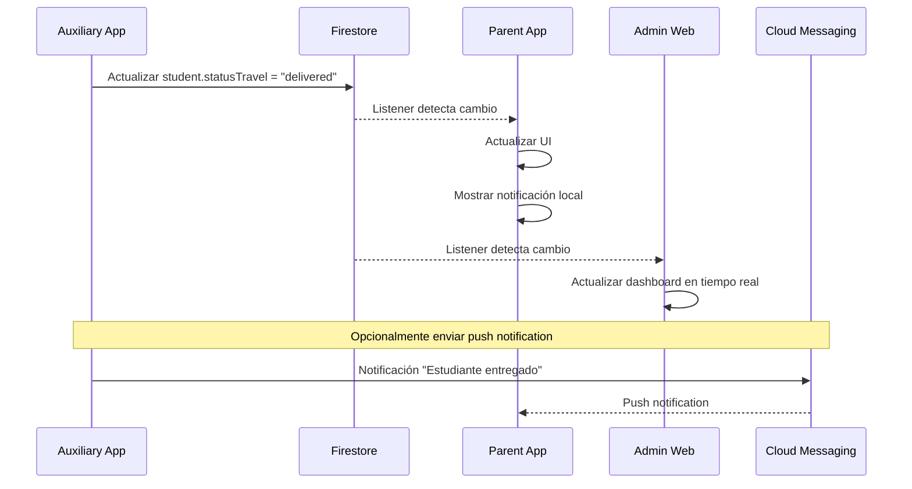

# Integración con Aplicaciones Móviles - RutEs

## Índice

1. [Introducción](#introducción)
2. [Ecosistema de Aplicaciones](#ecosistema-de-aplicaciones)
3. [Arquitectura de Integración](#arquitectura-de-integración)
4. [Base de Datos Compartida](#base-de-datos-compartida)
5. [Autenticación Unificada](#autenticación-unificada)
6. [Sistema de Notificaciones Push](#sistema-de-notificaciones-push)
7. [Sincronización en Tiempo Real](#sincronización-en-tiempo-real)
8. [Flujos de Integración](#flujos-de-integración)
9. [APIs Compartidas](#apis-compartidas)
10. [Mejores Prácticas](#mejores-prácticas)

## Introducción

RutEs es un ecosistema completo de gestión de transporte escolar que consta de tres aplicaciones complementarias que trabajan juntas para proporcionar una solución integral:

1. **RutEs-Admin** (Web) - Panel administrativo para escuelas
2. **RutEs Parent App** (Móvil iOS/Android) - Aplicación para padres/tutores
3. **RutEs Auxiliary App** (Móvil iOS/Android) - Aplicación para auxiliares/nanas

Todas las aplicaciones comparten la misma infraestructura backend (Firebase) y se comunican entre sí mediante datos sincronizados en tiempo real.

## Ecosistema de Aplicaciones

### Diagrama del Ecosistema



### Roles y Aplicaciones

| Aplicación | Usuarios | Rol en Firebase | Funcionalidad Principal |
|------------|----------|-----------------|-------------------------|
| **RutEs-Admin** | Administradores escolares | `admin`, `user-school` | Gestión completa del transporte |
| **Parent App** | Padres y tutores | `user`, `tutor` | Seguimiento de hijos en tiempo real |
| **Auxiliary App** | Auxiliares/nanas | `auxiliary` | Registro de entregas de estudiantes |

## Arquitectura de Integración

### Modelo de Comunicación



### Puntos de Integración

1. **Base de Datos Compartida (Firestore)**
   - Todas las apps leen/escriben en las mismas colecciones
   - Sincronización en tiempo real mediante listeners
   - Aislamiento de datos por `schoolId`

2. **Autenticación Común (Firebase Auth)**
   - Sistema de login unificado
   - Tokens JWT compartidos
   - Roles manejados en colección `profile`

3. **Notificaciones Push (FCM)**
   - Tokens almacenados en Firestore
   - Admin Web envía notificaciones
   - Apps móviles las reciben

4. **Almacenamiento (Firebase Storage)**
   - Fotos de perfil
   - Documentos adjuntos
   - Imágenes de evidencia

## Base de Datos Compartida

### Colecciones Compartidas

Todas las aplicaciones acceden a las mismas colecciones de Firestore:

#### 1. Collection: `profile`

**Uso en cada app:**

- **Admin Web**: Crea perfiles de padres/tutores al registrar estudiantes
- **Parent App**: Lee datos del perfil, actualiza tokens FCM, cambia contraseña
- **Aux App**: Lee datos del perfil, autentica con NIP

```typescript
profile/{userId} = {
  name: string,
  email: string,
  roles: string[],           // ["user"] para padres, ["auxiliary"] para nanas
  schoolId: string,
  students: DocumentReference[],  // Solo para padres/tutores
  tokens: string[],          // FCM tokens de dispositivos móviles
  password: string,          // Solo para auxiliares (NIP hasheado)
  createdAt: Timestamp
}
```

#### 2. Collection: `students`

**Uso en cada app:**

- **Admin Web**: CRUD completo de estudiantes
- **Parent App**: Lee solo estudiantes asignados al padre (read-only)
- **Aux App**: Lee estudiantes de su ruta, actualiza `statusTravel`

```typescript
students/{studentId} = {
  name: string,
  lastName: string,
  // ... otros campos
  statusTravel: string,      // "waiting" | "in-transit" | "delivered"
  // Actualizado por Aux App durante el viaje
}
```

#### 3. Collection: `routes` y `travels`

**Uso en cada app:**

- **Admin Web**: Crea y gestiona rutas
- **Parent App**: Lee ruta asignada al hijo
- **Aux App**: Lee ruta del día para saber qué estudiantes transportar

#### 4. Collection: `travelsWithFriend`

**Uso en cada app:**

- **Admin Web**: Aprueba o rechaza solicitudes
- **Parent App**: Crea solicitudes de cambio de ruta
- **Aux App**: No interactúa directamente

#### 5. Collection: `notificationsSchool`

**Uso en cada app:**

- **Admin Web**: Crea y envía notificaciones
- **Parent App**: Lee notificaciones de la escuela
- **Aux App**: Lee notificaciones relacionadas con rutas

## Autenticación Unificada

### Flujo de Autenticación



### Creación de Cuenta (Admin Web)

Cuando un administrador registra un estudiante con un padre nuevo:

```javascript
// En Admin Web - API Route
import { auth } from '@/firebase/admin';
import { doc, setDoc } from 'firebase/firestore';

async function createParentAccount(parentData, studentRef) {
  // 1. Crear usuario en Firebase Auth
  const userRecord = await auth.createUser({
    email: parentData.email,
    password: generateRandomPassword(), // Genera contraseña aleatoria
    displayName: `${parentData.name} ${parentData.lastName}`
  });

  // 2. Crear perfil en Firestore
  await setDoc(doc(db, 'profile', userRecord.uid), {
    name: parentData.name,
    lastName: parentData.lastName,
    email: parentData.email,
    phone: parentData.phone,
    roles: ['user'],
    schoolId: currentSchoolId,
    students: [studentRef], // Referencia al estudiante
    tokens: [],
    createdAt: Timestamp.now()
  });

  // 3. Enviar email con credenciales
  await sendWelcomeEmail(parentData.email, password);

  return userRecord.uid;
}
```

### Login en App Móvil (Parent App)

```javascript
// En Parent App (React Native / Flutter)
import { signInWithEmailAndPassword } from 'firebase/auth';
import { doc, getDoc, updateDoc, arrayUnion } from 'firebase/firestore';

async function loginParent(email, password) {
  try {
    // 1. Autenticar con Firebase
    const userCredential = await signInWithEmailAndPassword(
      auth,
      email,
      password
    );

    const user = userCredential.user;

    // 2. Obtener datos del perfil
    const profileDoc = await getDoc(doc(db, 'profile', user.uid));
    const profileData = profileDoc.data();

    // 3. Guardar token FCM para notificaciones
    const fcmToken = await messaging().getToken();
    await updateDoc(doc(db, 'profile', user.uid), {
      tokens: arrayUnion(fcmToken),
      lastLogin: Timestamp.now()
    });

    // 4. Verificar rol
    if (!profileData.roles.includes('user') && !profileData.roles.includes('tutor')) {
      throw new Error('Usuario no autorizado para esta aplicación');
    }

    // 5. Guardar en estado local
    return {
      uid: user.uid,
      email: user.email,
      ...profileData
    };

  } catch (error) {
    console.error('Login error:', error);
    throw error;
  }
}
```

### Login en Auxiliary App

Auxiliares se autentican con **email + NIP** (PIN de 4 dígitos):

```javascript
// En Auxiliary App
import { doc, getDoc, query, where, getDocs, collection } from 'firebase/firestore';
import bcrypt from 'bcryptjs'; // O equivalente en React Native

async function loginAuxiliary(email, nip) {
  try {
    // 1. Buscar auxiliar por email en colección auxiliars
    const q = query(
      collection(db, 'auxiliars'),
      where('email', '==', email)
    );
    const snapshot = await getDocs(q);

    if (snapshot.empty) {
      throw new Error('Auxiliar no encontrado');
    }

    const auxiliarDoc = snapshot.docs[0];
    const auxiliarData = auxiliarDoc.data();

    // 2. Buscar perfil
    const profileQ = query(
      collection(db, 'profile'),
      where('email', '==', email),
      where('roles', 'array-contains', 'auxiliary')
    );
    const profileSnapshot = await getDocs(profileQ);

    if (profileSnapshot.empty) {
      throw new Error('Perfil no encontrado');
    }

    const profileDoc = profileSnapshot.docs[0];
    const profileData = profileDoc.data();

    // 3. Verificar NIP
    const isValidNip = await bcrypt.compare(nip, profileData.password);
    if (!isValidNip) {
      throw new Error('NIP incorrecto');
    }

    // 4. Guardar token FCM
    const fcmToken = await messaging().getToken();
    await updateDoc(doc(db, 'profile', profileDoc.id), {
      tokens: arrayUnion(fcmToken),
      lastLogin: Timestamp.now()
    });

    return {
      uid: profileDoc.id,
      auxiliarId: auxiliarDoc.id,
      ...profileData,
      ...auxiliarData
    };

  } catch (error) {
    console.error('Auxiliary login error:', error);
    throw error;
  }
}
```

## Sistema de Notificaciones Push

### Arquitectura de Notificaciones



### Envío de Notificación (Admin Web)

```javascript
// app/api/notifications/route.js
import { messaging } from '@/firebase/admin';
import { collection, addDoc, getDocs, query, where } from 'firebase/firestore';

export async function POST(request) {
  const { title, body, category, userIds, schoolId } = await request.json();

  try {
    // 1. Obtener tokens FCM de los usuarios destinatarios
    const usersQuery = query(
      collection(db, 'profile'),
      where('__name__', 'in', userIds)
    );

    const usersSnapshot = await getDocs(usersQuery);
    const tokens = [];

    usersSnapshot.forEach(doc => {
      const userData = doc.data();
      if (userData.tokens && userData.tokens.length > 0) {
        tokens.push(...userData.tokens);
      }
    });

    // 2. Enviar notificación multicast
    if (tokens.length > 0) {
      const message = {
        notification: {
          title,
          body
        },
        data: {
          category,
          schoolId,
          timestamp: new Date().toISOString()
        },
        tokens
      };

      const response = await messaging.sendMulticast(message);

      console.log(`✅ ${response.successCount} notificaciones enviadas`);
      console.log(`❌ ${response.failureCount} fallos`);

      // 3. Limpiar tokens inválidos
      if (response.failureCount > 0) {
        const failedTokens = [];
        response.responses.forEach((resp, idx) => {
          if (!resp.success) {
            failedTokens.push(tokens[idx]);
          }
        });

        // Aquí deberías eliminar los tokens inválidos de Firestore
        await removeInvalidTokens(failedTokens);
      }
    }

    // 4. Guardar notificación en Firestore
    await addDoc(
      collection(db, `notificationsSchool/${schoolId}/notifications`),
      {
        title,
        body,
        category,
        sentTo: userIds,
        createdAt: Timestamp.now(),
        readByUser: false,
        readByAux: false,
        readByTutor: false,
        readBySchool: false
      }
    );

    return NextResponse.json({
      success: true,
      sent: tokens.length
    });

  } catch (error) {
    console.error('Error sending notification:', error);
    return NextResponse.json(
      { error: 'Error al enviar notificación' },
      { status: 500 }
    );
  }
}
```

### Recepción en App Móvil (Parent App)

```javascript
// En Parent App - Configuración de FCM
import messaging from '@react-native-firebase/messaging';
import { updateDoc, doc, arrayUnion } from 'firebase/firestore';

// Solicitar permiso de notificaciones
async function requestNotificationPermission() {
  const authStatus = await messaging().requestPermission();
  const enabled =
    authStatus === messaging.AuthorizationStatus.AUTHORIZED ||
    authStatus === messaging.AuthorizationStatus.PROVISIONAL;

  if (enabled) {
    console.log('Permisos de notificación otorgados');
    await registerFCMToken();
  }
}

// Registrar token FCM
async function registerFCMToken() {
  const token = await messaging().getToken();

  // Guardar en Firestore
  if (currentUser) {
    await updateDoc(doc(db, 'profile', currentUser.uid), {
      tokens: arrayUnion(token)
    });
  }
}

// Manejar notificaciones en primer plano
messaging().onMessage(async remoteMessage => {
  console.log('Notificación recibida en foreground:', remoteMessage);

  // Mostrar notificación local
  showLocalNotification({
    title: remoteMessage.notification.title,
    body: remoteMessage.notification.body,
    data: remoteMessage.data
  });
});

// Manejar notificación cuando app está en background
messaging().setBackgroundMessageHandler(async remoteMessage => {
  console.log('Notificación en background:', remoteMessage);
});

// Manejar tap en notificación
messaging().onNotificationOpenedApp(remoteMessage => {
  console.log('Notificación abierta:', remoteMessage);

  // Navegar a pantalla específica según categoría
  const { category } = remoteMessage.data;

  switch (category) {
    case 'emergency':
      navigation.navigate('Emergency', { data: remoteMessage.data });
      break;
    case 'travelWithFriend':
      navigation.navigate('TravelRequests');
      break;
    default:
      navigation.navigate('Notifications');
  }
});
```

## Sincronización en Tiempo Real

### Listeners en App Móvil

Las apps móviles usan listeners de Firestore para sincronización en tiempo real:

#### Parent App - Seguimiento de Estudiante

```javascript
// En Parent App
import { doc, onSnapshot } from 'firebase/firestore';

function TrackingScreen({ studentId }) {
  const [student, setStudent] = useState(null);

  useEffect(() => {
    // Listener en tiempo real
    const unsubscribe = onSnapshot(
      doc(db, 'students', studentId),
      (doc) => {
        if (doc.exists()) {
          const data = doc.data();
          setStudent({
            id: doc.id,
            ...data
          });

          // Mostrar notificación si el estado cambió
          if (data.statusTravel === 'delivered') {
            showNotification('¡Tu hijo ha sido entregado!');
          }
        }
      },
      (error) => {
        console.error('Error en listener:', error);
      }
    );

    // Cleanup al desmontar
    return () => unsubscribe();
  }, [studentId]);

  return (
    <View>
      <Text>Estado: {student?.statusTravel}</Text>
      {student?.statusTravel === 'in-transit' && (
        <Text>En tránsito...</Text>
      )}
      {student?.statusTravel === 'delivered' && (
        <Text>✅ Entregado</Text>
      )}
    </View>
  );
}
```

#### Auxiliary App - Lista de Estudiantes de la Ruta

```javascript
// En Auxiliary App
import { collection, query, where, onSnapshot } from 'firebase/firestore';

function RouteStudentsScreen({ routeId, day }) {
  const [students, setStudents] = useState([]);

  useEffect(() => {
    // Listener de la configuración de viajes
    const unsubscribe = onSnapshot(
      doc(db, 'travels', routeId),
      (doc) => {
        if (doc.exists()) {
          const travelData = doc.data();
          const dayData = travelData[day]; // "monday", "tuesday", etc.

          if (dayData && dayData.toSchool) {
            // Obtener estudiantes de todas las paradas
            const studentRefs = dayData.toSchool.stops.flatMap(
              stop => stop.students
            );

            // Suscribirse a cada estudiante
            loadStudentsWithListeners(studentRefs);
          }
        }
      }
    );

    return () => unsubscribe();
  }, [routeId, day]);

  const loadStudentsWithListeners = async (studentRefs) => {
    const unsubscribers = studentRefs.map(ref => {
      return onSnapshot(ref, (doc) => {
        if (doc.exists()) {
          setStudents(prev => {
            const index = prev.findIndex(s => s.id === doc.id);
            const studentData = { id: doc.id, ...doc.data() };

            if (index >= 0) {
              // Actualizar existente
              const newStudents = [...prev];
              newStudents[index] = studentData;
              return newStudents;
            } else {
              // Agregar nuevo
              return [...prev, studentData];
            }
          });
        }
      });
    });

    return () => unsubscribers.forEach(unsub => unsub());
  };

  return (
    <FlatList
      data={students}
      renderItem={({ item }) => (
        <StudentItem
          student={item}
          onMarkDelivered={() => markAsDelivered(item.id)}
        />
      )}
    />
  );
}
```

## Flujos de Integración

### Flujo 1: Registro de Estudiante y Creación de Cuenta de Padre



### Flujo 2: Solicitud de Viaje con Amigo



### Flujo 3: Actualización de Estado de Entrega



## APIs Compartidas

### Endpoints Consumidos por Apps Móviles

Aunque las apps móviles principalmente usan Firestore directamente, algunos endpoints de la API web también son consumidos:

#### 1. Actualización de Perfil

```javascript
// PATCH /api/auth/profile
// Usado por Parent App y Aux App para actualizar datos del perfil

// En Parent App
async function updateProfile(updates) {
  const response = await fetch(`${API_URL}/api/auth/profile`, {
    method: 'PATCH',
    headers: {
      'Authorization': `Bearer ${await user.getIdToken()}`,
      'Content-Type': 'application/json'
    },
    body: JSON.stringify(updates)
  });

  return response.json();
}
```

#### 2. Cambio de Contraseña

```javascript
// POST /api/auth/change-password
// Usado por Parent App

async function changePassword(currentPassword, newPassword) {
  const response = await fetch(`${API_URL}/api/auth/change-password`, {
    method: 'POST',
    headers: {
      'Authorization': `Bearer ${await user.getIdToken()}`,
      'Content-Type': 'application/json'
    },
    body: JSON.stringify({
      currentPassword,
      newPassword
    })
  });

  return response.json();
}
```

#### 3. Solicitud de Viaje con Amigo

```javascript
// POST /api/travel-with-friend
// Usado por Parent App

async function requestTravelWithFriend(studentId, day, targetRouteId) {
  const response = await fetch(`${API_URL}/api/travel-with-friend`, {
    method: 'POST',
    headers: {
      'Authorization': `Bearer ${await user.getIdToken()}`,
      'Content-Type': 'application/json'
    },
    body: JSON.stringify({
      studentId,
      day,
      routeId: targetRouteId
    })
  });

  return response.json();
}
```

## Mejores Prácticas

### 1. Manejo de Tokens FCM

```javascript
// Limpiar tokens inválidos o expirados
async function cleanupInvalidTokens(userIds, invalidTokens) {
  const batch = writeBatch(db);

  for (const userId of userIds) {
    const userRef = doc(db, 'profile', userId);
    batch.update(userRef, {
      tokens: arrayRemove(...invalidTokens)
    });
  }

  await batch.commit();
}
```

### 2. Offline Persistence en Apps Móviles

```javascript
// Habilitar persistencia offline en apps móviles
import { enableIndexedDbPersistence } from 'firebase/firestore';

// En React Native usar AsyncStorage
import { getReactNativePersistence, initializeFirestore } from 'firebase/firestore';
import AsyncStorage from '@react-native-async-storage/async-storage';

const db = initializeFirestore(app, {
  localCache: getReactNativePersistence(AsyncStorage)
});
```

### 3. Optimización de Listeners

```javascript
// Detener listeners cuando no sean necesarios
useEffect(() => {
  let unsubscribe;

  if (isActive) {
    unsubscribe = onSnapshot(
      doc(db, 'students', studentId),
      (doc) => {
        setStudent(doc.data());
      }
    );
  }

  return () => {
    if (unsubscribe) unsubscribe();
  };
}, [studentId, isActive]);
```

### 4. Caché de Datos Frecuentes

```javascript
// En apps móviles, cachear datos que no cambian frecuentemente
import AsyncStorage from '@react-native-async-storage/async-storage';

const CACHE_KEY = 'student_data';
const CACHE_DURATION = 5 * 60 * 1000; // 5 minutos

async function getStudentWithCache(studentId) {
  // Intentar obtener del caché
  const cached = await AsyncStorage.getItem(`${CACHE_KEY}_${studentId}`);

  if (cached) {
    const { data, timestamp } = JSON.parse(cached);
    if (Date.now() - timestamp < CACHE_DURATION) {
      return data;
    }
  }

  // Si no hay caché válido, obtener de Firestore
  const doc = await getDoc(doc(db, 'students', studentId));
  const data = doc.data();

  // Guardar en caché
  await AsyncStorage.setItem(
    `${CACHE_KEY}_${studentId}`,
    JSON.stringify({
      data,
      timestamp: Date.now()
    })
  );

  return data;
}
```

### 5. Manejo de Errores de Red

```javascript
// Detectar estado de conexión y mostrar UI apropiada
import NetInfo from '@react-native-community/netinfo';

function useNetworkStatus() {
  const [isConnected, setIsConnected] = useState(true);

  useEffect(() => {
    const unsubscribe = NetInfo.addEventListener(state => {
      setIsConnected(state.isConnected);
    });

    return () => unsubscribe();
  }, []);

  return isConnected;
}

// En componente
function StudentList() {
  const isConnected = useNetworkStatus();

  if (!isConnected) {
    return (
      <View>
        <Text>Sin conexión a internet</Text>
        <Text>Mostrando datos en caché</Text>
      </View>
    );
  }

  // ...
}
```

---

## Resumen

La integración entre RutEs-Admin y las aplicaciones móviles se basa en:

1. **Firebase como Backend Único**: Todas las apps comparten Firestore, Auth y FCM
2. **Sincronización en Tiempo Real**: Listeners de Firestore mantienen las apps actualizadas
3. **Notificaciones Push**: FCM permite comunicación instantánea
4. **Roles Unificados**: Sistema de roles en `profile` determina acceso
5. **Datos Compartidos**: Mismas colecciones, mismo formato
6. **Offline-first**: Apps móviles funcionan sin conexión

Este diseño permite que el ecosistema RutEs funcione como un sistema cohesivo donde cambios en una aplicación se reflejan inmediatamente en las demás, proporcionando una experiencia fluida para administradores, padres y auxiliares.

---

**Documento de Integración Móvil**
Última actualización: Noviembre 2025
Versión: 1.0
Sistema: RutEs Ecosystem
