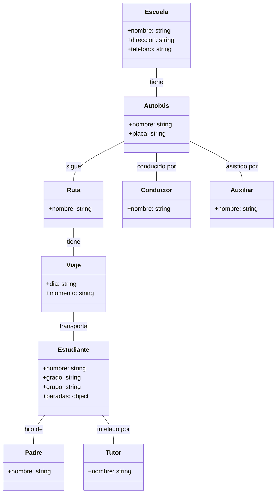

# Diagrama de colecciones para firestore

Este diagrama representa las relaciones entre tus colecciones. Por ejemplo, la flecha de "Autobuses" a "Rutas" indica que cada documento de "Autobuses" tiene una referencia a un documento de "Rutas" en su campo "ruta". Del mismo modo, la flecha de "Estudiantes" a "Viajes" indica que cada documento de "Viajes" tiene un array de referencias a documentos de "Estudiantes" en su campo "estudiantes".

